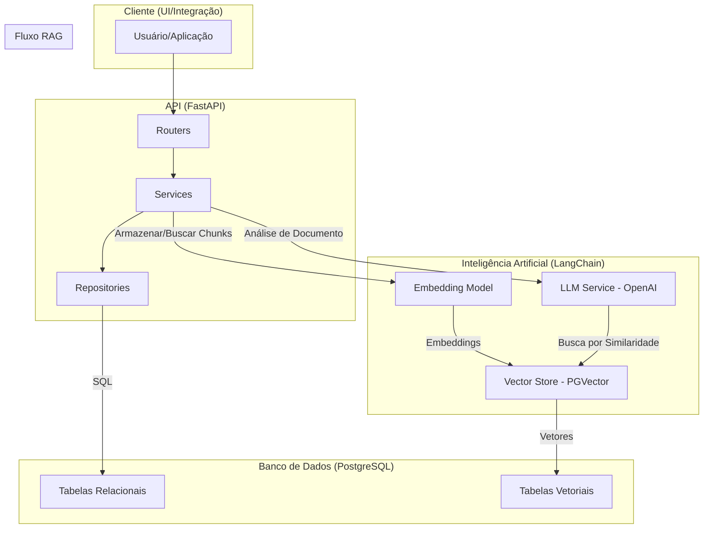

# Arquitetura

A plataforma **iaEditais** é estruturada em um conjunto de serviços coesos que operam de forma integrada para fornecer a funcionalidade de análise de editais. A arquitetura é baseada em uma API central, um banco de dados relacional/vetorial e integrações com serviços de IA.

## Componentes Principais

1.  **API (FastAPI)**: O núcleo do sistema, responsável por expor os endpoints RESTful. A aplicação é dividida em três camadas principais:
    * **Routers (`iaEditais/routers`)**: Definem os endpoints da API, lidam com a validação de dados de entrada (usando Pydantic) e encaminham as requisições para a camada de serviço.
    * **Services (`iaEditais/services`)**: Contêm a lógica de negócio. Orquestram as operações, manipulam os dados e se comunicam com a camada de repositório e com as integrações externas (como a de IA).
    * **Repositories (`iaEditais/repositories`)**: Abstraem o acesso ao banco de dados. Contêm as queries SQL para manipulação e consulta dos dados, separando a lógica de negócio da persistência.

2.  **Banco de Dados (PostgreSQL + pgvector)**: Atua como a camada de persistência.
    * **Tabelas Relacionais**: Armazenam os dados estruturados do sistema, como fontes, tipificações, taxonomias, ramos e documentos. O esquema é definido em `init.sql`.
    * **Banco Vetorial (`pgvector`)**: Integrado ao PostgreSQL, armazena os embeddings (vetores) dos trechos de documentos. É essencial para a funcionalidade de busca por similaridade do RAG.

3.  **Integração de IA (LangChain)**: Componente responsável pela análise de conteúdo dos documentos.
    * **Embedding Model**: Utiliza `text-embedding-3-large` da OpenAI para converter os textos dos documentos em vetores numéricos (embeddings).
    * **LLM (Large Language Model)**: Usa o modelo `gpt-4o-mini` da OpenAI para interpretar o conteúdo recuperado do edital e gerar a análise com base nos critérios definidos na árvore de verificação.
    * **RAG Pipeline (`release_integration.py`)**: Quando um documento é submetido para análise, ele é segmentado em *chunks*, transformado em vetores e armazenado. Para cada critério (ramo) da árvore, o sistema busca os *chunks* mais relevantes no banco vetorial e os fornece como contexto para o LLM gerar um feedback.

## Fluxo de Análise de um Documento

1.  **Upload e Armazenamento**: Um usuário envia um arquivo PDF através do endpoint `POST /doc/{doc_id}/release/`.
2.  **Segmentação e Vetorização**: O serviço `doc_service` chama a `release_integration`. O arquivo PDF é carregado, dividido em *chunks* de texto e cada *chunk* é convertido em um vetor (embedding) pelo modelo de embedding.
3.  **Persistência Vetorial**: Os *chunks* e seus respectivos vetores são salvos na coleção do PGVector.
4.  **Construção da Árvore**: O sistema recupera a árvore de verificação associada ao documento.
5.  **Análise RAG por Ramo**: Para cada ramo (critério específico) na árvore:
    * A descrição do ramo é usada como uma *query* para buscar os *chunks* mais relevantes no banco vetorial.
    * Um prompt estruturado, contendo os *chunks* recuperados e a descrição do critério, é enviado ao LLM.
    * O LLM retorna uma avaliação (se o critério foi atendido) e um feedback, que são armazenados.
6.  **Retorno**: O resultado completo da análise é persistido na tabela `releases` e retornado ao usuário.