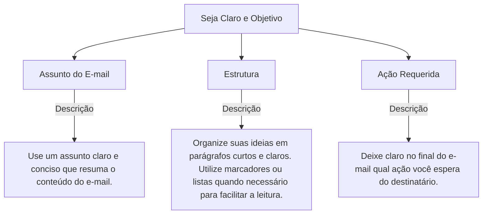

# Taxonomia

A **taxonomia** do **iaEditais** é uma estrutura organizada que auxilia na validação e revisão de editais de forma padronizada. Cada **taxonomia** consiste em uma série de **branches** (ramificações), que são subdivisões específicas de temas que precisam ser analisados. Essas ramificações podem ter descrições detalhadas sobre o que precisa ser verificado em cada aspecto do edital, garantindo a conformidade e a clareza do documento.

## Estrutura da Taxonomia

A taxonomia pode ser visualizada como um conjunto de categorias **roots**, que podem ter várias **branches** dentro delas. Cada **branch** contém informações detalhadas sobre um aspecto específico do que esta sendo avaliado.

Por exemplo, uma taxonomia pode estar relacionada a elaboração de um e-mail, temos então a raiz como:

- **Seja Claro e Objetivo**
  
Dentro dessa taxonomia, temos as seguintes ramificações:

1. **Assunto do E-mail**: "Use um assunto claro e conciso que resuma o conteúdo do e-mail."
2. **Estrutura**: "Organize suas ideias em parágrafos curtos e claros. Utilize marcadores ou listas quando necessário para facilitar a leitura."
3. **Ação Requerida**: "Deixe claro no final do e-mail qual ação você espera do destinatário."

### Exemplo Visual da Estrutura da Taxonomia

Veja como a estrutura de uma taxonomia se organiza, com base nas informações acima:

## Como a Taxonomia Funciona na Prática

Quando um edital é analisado, ele é comparado com a raiz das taxonomias e suas ramificações para garantir que todos os aspectos relevantes sejam abordados. Por exemplo, para garantir que o e-mail seja claro e objetivo, as verificações podem ser feitas em cada **branch** (ramificação), como o **Assunto do E-mail** e a **Estrutura**.

Essa taxonomia e as ramificações ajudam a garantir que os editores de documentos sigam as melhores práticas, como o uso de uma linguagem formal, revisão cuidadosa e clareza nas informações fornecidas.
