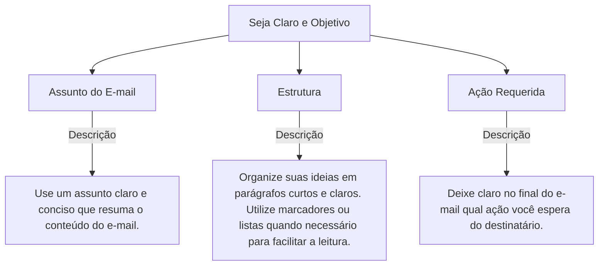
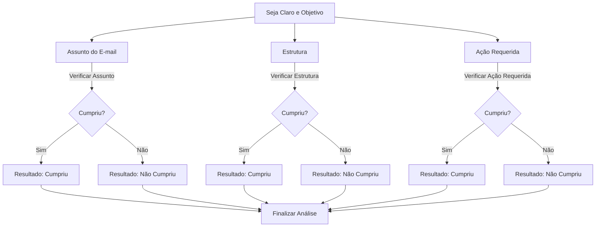

# Taxonomia

A **taxonomia** do **iaEditais** é uma estrutura organizada que auxilia na validação e revisão de editais de forma padronizada. Cada **taxonomia** consiste em uma série de **branches** (ramificações), que são subdivisões específicas de temas que precisam ser analisados. Essas ramificações podem ter descrições detalhadas sobre o que precisa ser verificado em cada aspecto do edital, garantindo a conformidade e a clareza do documento.

## Estrutura da Taxonomia

A taxonomia pode ser visualizada como um conjunto de categorias **roots**, que podem ter várias **branches** dentro delas. Cada **branch** contém informações detalhadas sobre um aspecto específico do que esta sendo avaliado.

Por exemplo, uma taxonomia pode estar relacionada a elaboração de um e-mail, temos então a raiz como:

- **Seja Claro e Objetivo**
  
Dentro dessa taxonomia, temos as seguintes ramificações:

1. **Assunto do E-mail**: "Use um assunto claro e conciso que resuma o conteúdo do e-mail."
2. **Estrutura**: "Organize suas ideias em parágrafos curtos e claros. Utilize marcadores ou listas quando necessário para facilitar a leitura."
3. **Ação Requerida**: "Deixe claro no final do e-mail qual ação você espera do destinatário."

### Exemplo Visual da Estrutura da Taxonomia

Veja como a estrutura de uma taxonomia se organiza, com base nas informações acima:

### Como a Taxonomia Funciona na Prática

Na prática, a taxonomia organiza a análise do edital com base nas ramificações definidas para cada aspecto relevante. Quando um documento é submetido à revisão, ele segue um caminho que examina cada ramo da taxonomia e valida se as especificações estão sendo cumpridas.

Cada ramo de uma taxonomia tem critérios específicos de verificação. Se todos os critérios de um ramo são atendidos, o processo continua com a próxima ramificação. Se algum critério não for cumprido, o resultado será uma resposta negativa para essa ramificação, indicando que o edital precisa ser ajustado.

### Exemplo Visual de Validação da Taxonomia

O diagrama a seguir mostra como a análise do edital segue a taxonomia, ramificando-se em direções específicas e retornando uma resposta de "Cumpriu" ou "Não Cumpriu".

### Explicação do Diagrama

1. O diagrama começa com a raiz da taxonomia **"Seja Claro e Objetivo"**.
2. A análise segue para três ramificações principais: **Assunto do E-mail**, **Estrutura** e **Ação Requerida**.
3. Para cada uma dessas ramificações, um processo de verificação é realizado (ex: "Verificar Assunto", "Verificar Estrutura", "Verificar Ação Requerida").
4. Em cada ramificação, o resultado é avaliado: se **cumpriu** o critério, a análise continua para a próxima. Se **não cumpriu**, a resposta será "Não Cumpriu", e ajustes no edital são necessários.
5. Ao final de todas as verificações, o processo de validação é concluído, indicando se o edital está conforme os critérios ou se precisa de ajustes.

Esse processo assegura que todos os aspectos do edital sejam avaliados de forma estruturada e padronizada, garantindo que o documento final atenda a todos os critérios estabelecidos pela taxonomia.
