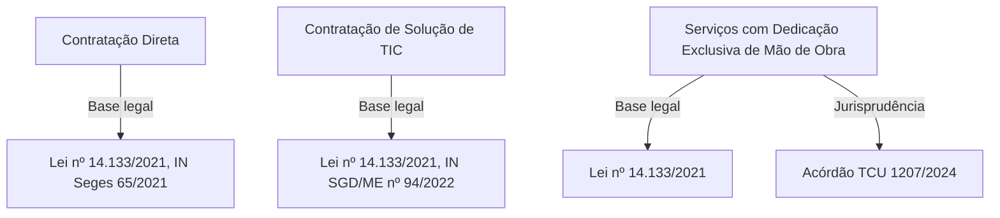
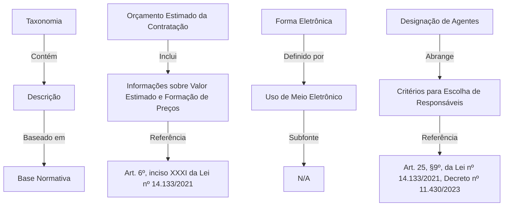
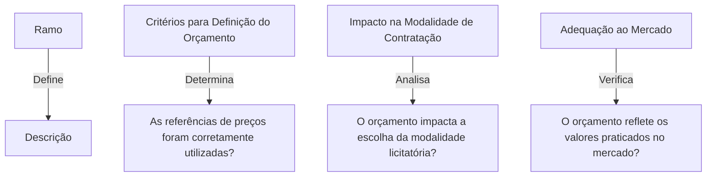
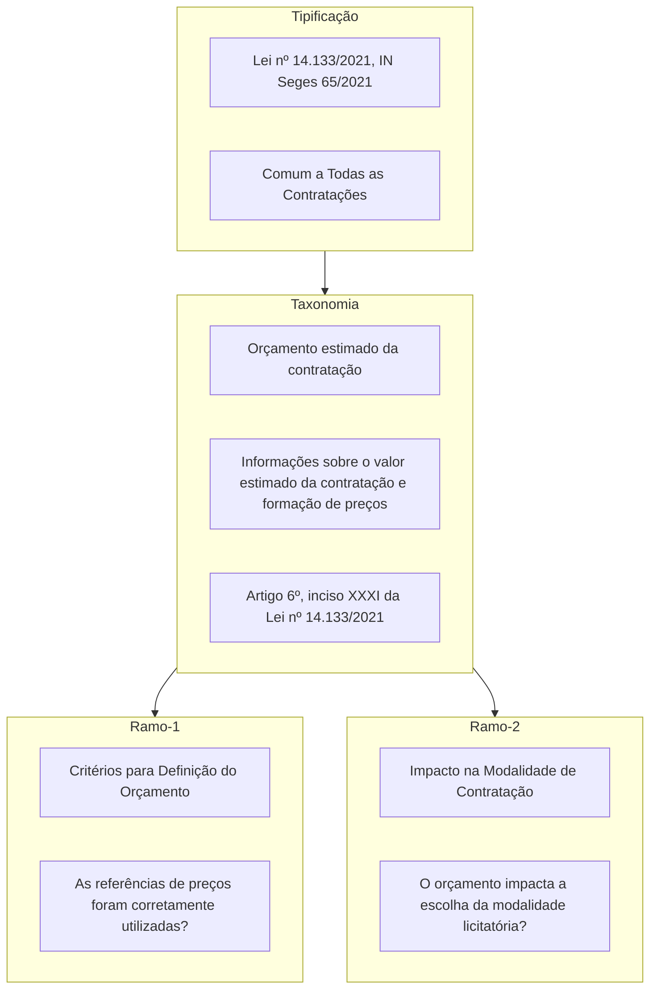

# Árvore de Verificação  

A **árvore** do **iaEditais** é uma estrutura organizada que padroniza a validação e revisão de editais, tornando o processo mais eficiente e estruturado. 🌳  

## Tipificação 🧵

Cada **árvore** é baseada em uma **tipificação** 🧵, que possui um título e pode estar vinculada a uma fonte específica, como uma lei ou norma interna. Essa tipificação também está associada ao edital, garantindo coerência na análise.  

## Taxonomia 🪢

No segundo nível, chamado **taxonomia**, cada item contém um nome, uma descrição, uma subfonte (opcional) e seus respectivos ramos (*branches*), que estruturam a segmentação da análise.

## Ramificações 🪡

As **ramificações** representam subdivisões específicas dos temas a serem analisados. Localizadas na extremidade da árvore, contêm descrições detalhadas dos aspectos do edital que precisam ser verificados. Aqui, você deve adicionar as questões que serão submetidas ao modelo, recebendo um retorno positivo, negativo e um feedback.  

## Exemplo Completo 🌳

Abaixo, segue um exemplo consolidado da árvore de verificação em sua totalidade, representando o fluxo desde a tipificação até as ramificações finais:

Esse modelo fornece um bom referencial para a análise dos editais 🚀
