# Árvore de Verificação  

A **árvore** do **iaEditais** é uma estrutura organizada que padroniza a validação e revisão de editais, tornando o processo mais eficiente e estruturado. 🌳  

## Tipificação 🧵

Cada **árvore** é baseada em uma **tipificação** 🧵, que possui um título e pode estar vinculada a uma fonte específica, como uma lei ou norma interna. Essa tipificação também está associada ao edital, garantindo coerência na análise.  


## Taxonomia 🪢

No segundo nível, chamado **taxonomia**, cada item contém um nome, uma descrição, uma subfonte (opcional) e seus respectivos ramos (*branches*), que estruturam a segmentação da análise.

```mermaid
graph TD
    A[Taxonomia] -->|Contém| B[Descrição] -->|Baseado em| C[Subfonte]

    A1[Processo Administrativo] -->|Inclui| A2[Aspectos sobre abertura do processo]
    A2 -->|Referência| A3[Art. 18, XI, da Lei 14133/21, Art. 10 da IN Seges 65/2021]

    A5[Forma Eletrônica] -->|Definição| A6[Uso de meio eletrônico]
    A6 -->|Subfonte| A7[N/A]

    A9[Designação de Agentes] -->|Abrange| A10[Critérios para escolha de responsáveis]
    A10 -->|Referência| A11[Art. 25, §9º, da Lei 14133/21, Decreto 11430/23]
```



## Ramificações 🪡

As **ramificações** representam subdivisões específicas dos temas a serem analisados. Localizadas na extremidade da árvore, contêm descrições detalhadas dos aspectos do edital que precisam ser verificados. Aqui, você deve adicionar as questões que serão submetidas ao modelo, recebendo um retorno positivo, negativo e um feedback.  

```mermaid
graph TD
    A[Ramo] -->|Define| B[Descrição]

    A1[Justificativa para Vedação de Participação de Consórcios] -->|Avalia| B1[Há justificativa para a vedação?]
    A2[Registro de Processo Administrativo em Sistema Informatizado] -->|Verifica| B2[O procedimento foi registrado corretamente?]
    A3[Exclusividade de Itens Inferiores a R$80.000,00 para ME/EPPs] -->|Checa| B3[Os itens foram destinados corretamente ou há justificativa válida?]
```



## Exemplo Completo 🌳

Abaixo, segue um exemplo consolidado da árvore de verificação em sua totalidade, representando o fluxo desde a tipificação até as ramificações finais:

```mermaid
graph TD
    subgraph Tipificação
        A1[Lei nº 14.133/2021, IN Seges 65/2021]
        A[Comum a Todas as Contratações Diretas]
    end

    subgraph Taxonomia
        B[Processo Administrativo]
        B1[Aspectos sobre Abertura do Processo]
        B2[Art. 18, Inciso XI] 
    end

    subgraph Ramo-1
        C[Justificativa para Vedação à Participação de Consórcios]
        C1[Há Justificativa para a Vedação?]
    end

    subgraph Ramo-2
        D[Justificativa para Vedação à Participação de Consórcios]
        D1[Há Justificativa para a Vedação?]
    end

    Tipificação --> Taxonomia 
    Taxonomia --> Ramo-1
    Taxonomia --> Ramo-2
```  

Esse modelo fornece um referencial para a análise dos editais 🚀
